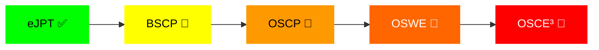

<div align="center">

# 👾 Songül Kızılay Özügürler

[](https://git.io/typing-svg)


</div>

---

## 🎯 About Me

```bash
medsa@sixpon:~$ cat bio.txt
```

🔐 **Security Researcher** obsessed with finding vulnerabilities the hard way  
🧠 Daily grinder on **PortSwigger Academy**, **Hack The Box**, **TryHackMe**  
🐛 Active bug bounty hunter | HackerOne: **[@meddsa](https://hackerone.com/meddsa)**  
📝 Technical writer sharing **real-world attack chains** on [Medium](https://medium.com/@songulkizilay)  
🎓 Working towards **Burp Suite Certified Practitioner (BSCP)**  
⚙️ Building automation tools for recon & exploitation workflows  
🎥 Creating cybersecurity content on **[YouTube](https://youtube.com/sixpon)** | **[sixpon.com](https://sixpon.com)**

> *"Real attackers don't just press 'scan' — they think, analyze, and exploit manually."*

---

## 🎯 Current Year Goals

- [ ] 🏆 Achieve BSCP Certification
- [ ] 🐛 Submit 50+ Valid Bug Bounty Reports
- [ ] 📝 Publish 30+ Security Writeups on Medium
- [ ] 🎓 Complete HTB Bug Bounty Hunter Path
- [ ] 🔥 Reach Top 100 on HackerOne Turkey
- [ ] 🎬 Grow YouTube channel to 1K subscribers

---

## 🛡️ Current Focus

<table>
<tr>
<td width="50%">

### 🔥 Active Training
- ✅ PortSwigger Web Security Academy
- ✅ Hack The Box - Bug Bounty Hunter Path
- ✅ TryHackMe Web Security Rooms
- ⏳ BSCP Exam Preparation

</td>
<td width="50%">

### 🎯 Hunting On
- 🔍 HackerOne Private Programs
- 🔍 Manual IDOR & SQLi Hunting
- 🔍 GraphQL API Security
- 🔍 Subdomain Takeover Research

</td>
</tr>
</table>

---

## 📊 Skill Proficiency

<table>
<tr>
<td width="50%">

**Web Application Security**
```
███████████████████░░  85%
```

**Penetration Testing**
```
████████████████░░░░  80%
```

**Bug Bounty Hunting**
```
███████████████░░░░░  75%
```

</td>
<td width="50%">

**Manual Code Review**
```
██████████████░░░░░░  70%
```

**Exploit Development**
```
█████████████░░░░░░░  65%
```

**API Security Testing**
```
███████████████░░░░░  75%
```

</td>
</tr>
</table>

---

## 🎓 Certification Journey



---

## 📚 Featured Security Writeups

<details>
<summary>🔓 <b>PortSwigger Labs</b></summary>

<br>

- 🔗 [Brute-forcing a Stay-Logged-In Cookie](https://medium.com/@songulkizilay/portswigger-lab-brute-forcing-a-stay-logged-in-cookie-99c841c14b97)
- 🔗 [Username Enumeration via Response Timing](https://medium.com/@songulkizilay/portswigger-academy-lab-username-enumeration-via-response-timing-writeup-df23aeea8bd8)
- 🔗 [Blind SQL Injection with Conditional Responses](https://medium.com/@songulkizilay)
- 🔗 [UNION-based SQLi Exploitation](https://medium.com/@songulkizilay)

</details>

<details>
<summary>📦 <b>Hack The Box Machines</b></summary>

<br>

- 🔗 [HTB: Nibbles - Easy Linux Box](https://medium.com/@songulkizilay/hackthebox-nibbles-writeup-0feb6141baf1)
- 🔗 [HTB: Shocker - CVE-2014-6271 Exploitation](https://medium.com/@songulkizilay/hackthebox-shocker-writeup-3bdf669d5834)
- 🔗 [HTB: Lame - SMB & Samba Exploitation](https://medium.com/@songulkizilay)

</details>

<details>
<summary>🚩 <b>TryHackMe Rooms</b></summary>

<br>

- 🔗 [Pyramid of Pain - Threat Intelligence](https://medium.com/@songulkizilay/tryhackme-pyramid-of-pain-walkthrough-f51a2d3096d1)
- 🔗 [OWASP Top 10 - Web Application Security](https://medium.com/@songulkizilay)
- 🔗 [Web Fundamentals - Complete Walkthrough](https://medium.com/@songulkizilay)

</details>

<details>
<summary>🐛 <b>Bug Bounty Reports</b></summary>

<br>

- 🔒 [IDOR in GraphQL API - Private Program]
- 🔒 [Subdomain Takeover via Dangling CNAME - CLEAR]
- 🔒 [Blind SQL Injection in Search Function - Private Program]
- 🔒 [OAuth2 Redirect URI Bypass - Whatnot]

*Detailed public reports coming soon after disclosure periods*

</details>

---

## 🧰 Arsenal

### 🔧 Primary Tools


### 💻 Languages & Scripting


### 🗄️ Tech Stack


---

## 📊 GitHub Stats

<div align="center">


</div>

---

## 🔥 Contribution Streak

<div align="center">


</div>

---

## 🏆 GitHub Trophies

<div align="center">


</div>

---

## 📌 Pinned Repositories

<div align="center">

<a href="https://github.com/Songul-Kizilay/Songul-Kizilay">
  
</a>

</div>

---

## 🎖️ HackerOne Stats

<div align="center">


**🎯 Active on Private Programs | 🐛 Focused on Web Security**

</div>

---

## 💻 Weekly Development Breakdown

<!--START_SECTION:waka-->
<!--END_SECTION:waka-->

---

## 🌐 Connect With Me

<div align="center">

[](https://www.linkedin.com/in/songulkizilay/)
[](https://medium.com/@songulkizilay)
[](https://hackerone.com/meddsa)
[](https://www.hackerrank.com/songulkizilay46)
[](https://youtube.com/sixpon)
[](https://sixpon.com)

</div>

---

## 💡 Latest Blog Posts

<!-- BLOG-POST-LIST:START -->
<!-- This section will be automatically updated with your latest Medium articles -->
<!-- BLOG-POST-LIST:END -->

---

## 📈 Contribution Activity

<div align="center">


</div>

---

## ☕ Support My Work

<div align="center">

If you find my security research and writeups valuable, consider supporting me:


**Every bug found is a lesson learned. Every writeup shared is knowledge multiplied.** 🚀

</div>

---

<div align="center">

### ⚡ "Manual exploitation over blind automation — because real attackers think, not just scan."


---

**💼 Open for Security Collaborations | 🐛 Bug Bounty Partnerships | 📧 Contact: songulkizilay@gmail.com**


</div>
